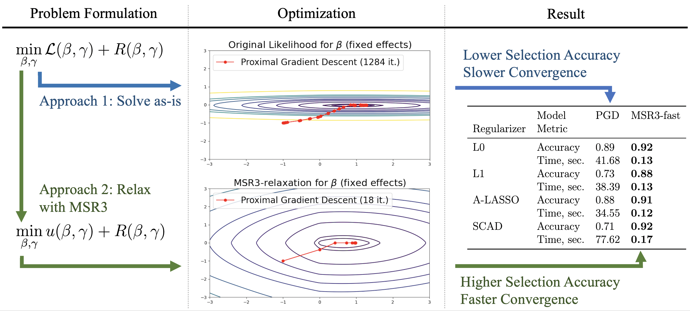

# Summary

Datasets increasingly contain more and more potential covariates that may be related to different research questions. The presence of irrelevant or weakly relevant features can be counterproductive to modeling, as over-parametrized models may lead to unstable estimates, invalid inference, and low prediction accuracy. Reliable feature selection is a requirement for a wide range of regression settings. 

Feature selection methods are a hot research topic [@Buscemi2019Survey],[@miao2016survey],[@li2020survey], with a plethora of numerical approaches and corresponding implementations. 
However, most of the current state-of-the-art tools custom-tailor their implementation to their mathematical approach (e.g. use an optimization scheme that works only for a particular regularizer). 
In practice, it forces practitioners to re-implement their workflow for each method that they want to use or try, even when the difference between methods is minor. The absence of universal open source implementations effectively blocks practitioners from comparing all available methods, with the effect 
of slowing uptake of research results in the field. 

We fill this gap by implementing recently developed universal solvers [@zheng2018unified], [@sholokhov2022relaxation] that (1) work with most popular regularized regression techniques, and (2) improve selection accuracy of any regularized regression approach using new relaxation reformulations. 
To date, the library supports linear models (classic regression) and linear mixed effects models. Because of full compatibility with `sklearn`, all `pysr3` models can be used in pipeline with classic modelling blocks such as data pre-processors, randomized grid search, cross-validation, and quality metrics.

# Statement of Need
   
Reliable automated feature selection requires easy-to-use libraries, so that practitioners can test and compare multiple regularization approaches using their data, choose the most effective method, and apply the analysis at scale. These libraries should be flexible and modular enough to accommodate future developments, such as newly proposed regularizers, without forcing the practitioner to implement new solvers for each approach. At the same time, the libraries must be efficient and robust enough to handle common challenges such as ill-conditioned problems that arise in datasets with correlated predictors. The PySR3 library is designed to easily include new loss functions, constraints, information criteria, and regularization strategies. All PySR3 models fully adhere the standards and interface requirements of `sklearn` [@sklearn_api], providing a familiar interface to users. 

Currently, PySR3 models can be used to automatically select features in both linear regression models and linear mixed effects (LME) models, which extend linear regression to clustered data settings. LME models commonly arise in longitudinal data analysis and meta-analysis. Feature selection for linear mixed-effects models is harder than for linear regression models due to  non-linearity of LMEs and within-group correlations. To the best of our knowledge, there are no standalone Python packages for mixed-effect feature selection, while the alternatives implemented in R, such as lmmlasso [@schelldorfer2011estimation] and glmmlasso [@schelldorfer2014glmmlasso], take more time to converge and yield worse selection accuracy, as discussed in [@sholokhov2022relaxation].

# Core idea and structure of `pysr3`

The baseline optimization method of PySR3 is proximal gradient descent (PGD). PGD exploits the fact that most feature selection methods minimize the sum of a smooth loss that captures the negative log likelihood of the data and a non-smooth sparsity promoting regularizer. 
PGD works well as long as the regularizer has an implementable proximal operator. 
Many widely-used regularizers have proximal operators that are well known and either have efficient numerical routines or closed form solutions [@zheng2018unified]. Examples include the zero-norm (L0), least absolute shrinkage and selection operator (LASSO), adaptive LASSO (A-LASSO), and smoothly clipped absolute deviation (SCAD) regularizers.

Each regularizer included in PySR3 can also be used in its relaxed SR3 form [@zheng2018unified]. SR3 preconditions the likelihood, improving the performance of feature selection methods. 
PGD on the SR3-transformed problem takes fewer iterations to converge, and the features selected 
are more accurate and have lower false positive rates across simulated examples for both linear regression [@zheng2018unified] and LME [@sholokhov2022relaxation] models, as illustrated on \autoref{fig:lme_summary} (adapted from Figure 1 from  [@sholokhov2022relaxation]).

More information about the structure of the library can be found in [documentation](https://aksholokhov.github.io/pysr3/), 
while the mathematical contributions are extensively discussed in [@zheng2018unified] for linear regression 
and in [@sholokhov2022relaxation],[@aravkin2022relaxationb] for linear mixed effects models.

# Ongoing Research and Dissemination

The manuscripts "A Relaxation Approach to Feature Selection for Linear Mixed Effects Models" 
and "Analysis of Relaxation Methods for Feature Selection in Mixed Effects Models"
are undergoing simultaneous peer-review. Since its introduction in [@zheng2018unified], SR3 has been cited 92 times, and used in model discovery [@Mendible2020], optimal dose management [@levin2019proof] and inverse problems [@baraldi2019basis]. The LME extensions of PySR3 was developed for variable selection in meta-analysis, which is a fundamental problem in risk factor analysis for the Global Burden of Disease study [@murray2020global].  

# References
